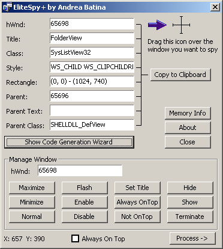



## EliteSpy\+ \(with Code Generator\)

### Description

EliteSpy+ is program for spying windows. You can spy any window and you can manipulate them using the command buttons in Program. You can minimize, maximize, terminate, enable, disable, flash, put on top, etc.

This program also contains a code generator which you can use to generate code which will manipulate with the specified window.

There is also a list of running process. You can also terminate any process you want.

And please vote for this program if you like it!
 
### More Info
 

             |
---                |---
**Submitted On**   |2001-10-31 08:06:16
**By**             |[Andrea Batina\[Revelatek\]](https://github.com/Planet-Source-Code/PSCIndex/blob/master/ByAuthor/andrea-batina-revelatek.md)
**Level**          |Advanced
**User Rating**    |4.5 (239 globes from 53 users)
**Compatibility**  |VB 4\.0 \(32\-bit\), VB 5\.0, VB 6\.0
**Category**       |[Complete Applications](https://github.com/Planet-Source-Code/PSCIndex/blob/master/ByCategory/complete-applications__1-27.md)
**World**          |[Visual Basic](https://github.com/Planet-Source-Code/PSCIndex/blob/master/ByWorld/visual-basic.md)
**Archive File**   |[EliteSpy\+ 324591112001\.zip](https://github.com/Planet-Source-Code/andrea-batina-revelatek-elitespy-with-code-generator__1-28563/archive/master.zip)

